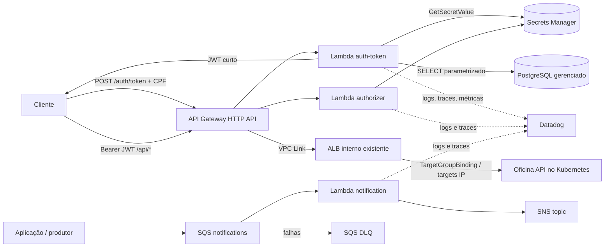

# Oficina Auth Serverless

Repositório da autenticação serverless da Oficina API. Ele entrega:

- `POST /auth/token` em uma AWS API Gateway HTTP API;
- Lambda Node.js 22 que valida os dígitos do CPF, normaliza a máscara, consulta o cliente no PostgreSQL e emite um JWT HS256 curto;
- Lambda authorizer independente para a rota protegida `ANY /api/{proxy+}`;
- integração privada dessa rota com um listener de ALB interno por API Gateway VPC Link;
- integração concreta com Datadog Serverless Monitoring;
- fluxo opcional de notificações `SQS -> Lambda -> SNS`, com DLQ;
- Terraform modular e pipelines de CI/CD com autenticação AWS por GitHub OIDC.

Nenhum segredo é criado, versionado ou gravado no state deste repositório. Os valores de banco, JWT e API key do Datadog são lidos em execução diretamente do AWS Secrets Manager.

## Arquitetura



O API Gateway, o ALB e o VPC Link precisam estar na mesma conta AWS. O listener do ALB interno, as subnets e os security groups são contratos fornecidos pelo repositório de infraestrutura Kubernetes; o aplicativo registra targets IP por `TargetGroupBinding`. Os contratos podem ser passados diretamente ou por remote state S3.

## Tecnologias

- Node.js 22, TypeScript e esbuild;
- Jest e ts-jest;
- AWS Lambda, API Gateway HTTP API, VPC Link, SQS, SNS e Secrets Manager;
- PostgreSQL com `pg` e query parametrizada;
- Terraform >= 1.10;
- Datadog Lambda Node layer e Lambda Extension;
- GitHub Actions e AWS OIDC.

Não há Dockerfile porque a unidade de deploy aplicável é um bundle ZIP de AWS Lambda, gerado por `npm run build` e empacotado pelo provider `archive` do Terraform.

## Contrato HTTP

O contrato OpenAPI versionado está em [openapi.yaml](./openapi.yaml). Este repositório não hospeda Swagger UI; portanto o link de Swagger publicado é **N/A até que um ambiente seja implantado**. O arquivo OpenAPI pode ser importado no Swagger Editor ou no Postman.

### Autenticar cliente

```http
POST /auth/token
Content-Type: application/json
X-Correlation-Id: demo-001

{"cpf":"529.982.247-25"}
```

Resposta:

```json
{
  "access_token": "<jwt>",
  "token_type": "Bearer",
  "expires_in": 300,
  "scope": "orders:read orders:write"
}
```

O JWT possui assinatura HS256 e os claims:

| Claim | Valor |
|---|---|
| `iss` | `oficina-auth-serverless`, configurável |
| `aud` | `oficina-api`, configurável |
| `sub` | `clientes.id` |
| `client_id` | `clientes.id` |
| `role` | `CLIENTE` |
| `token_use` | `client` |
| `scopes` | lista configurável |
| `jti` | UUID aleatório por token |
| `iat`, `exp` | emitido em e expiração curta |

O token não contém CPF nem `usuarioId`. O segredo também contém `refreshSecret` para manter o contrato já usado pelo login de operadores na aplicação principal, mas esta Lambda não emite refresh token para autenticação por CPF.

O API Gateway deixa públicos somente `POST /auth/token`, os probes, o Swagger e o bootstrap/refresh do login de operadores. O proxy restante exige o authorizer, que aceita access tokens de cliente e de operador; o NestJS revalida identidade ativa e papéis. `CORS_ALLOWED_ORIGINS_JSON` deve listar origens explícitas de cada environment.

CPF inválido, cliente ausente e cliente inativo retornam exatamente a mesma resposta `401`, evitando enumeração de cadastro. Falhas internas retornam mensagem genérica `500`.

No runtime Node.js 22, `NODE_EXTRA_CA_CERTS=/var/runtime/ca-cert.pem` carrega as CAs gerenciadas pela AWS para que o cliente PostgreSQL valide o certificado do RDS Proxy, mantendo `rejectUnauthorized` ativo.

### Query do cliente

A consulta usa parâmetros e espera CPF normalizado no banco:

```sql
SELECT id::text AS id, ativo
FROM clientes
WHERE "tipoDoc" = 'CPF'
  AND "numeroDoc" = $1
LIMIT 1;
```

O schema Prisma é o proprietário desses identificadores camelCase; `numeroDoc` já é único e a Fase 3 acrescenta índice para `("tipoDoc", ativo)`.

### Consumir rota protegida

```http
GET /api/v1/ordens-servico/minhas/lista
Authorization: Bearer <jwt>
X-Correlation-Id: demo-002
```

O authorizer verifica exclusivamente HS256, `iss`, `aud`, expiração e os claims obrigatórios de access tokens de cliente ou operador. Após autorização, o API Gateway sobrescreve headers internos mínimos (`x-auth-sub`, `x-auth-client-id`, `x-auth-role`, `x-auth-scopes` e `x-token-use`) antes de encaminhar a requisição. A aplicação principal continua validando o Bearer JWT e a identidade ativa; headers internos isoladamente não são credenciais.

## Segredos

### Banco de dados

O ARN informado por `db_secret_arn` deve apontar para JSON neste formato:

```json
{
  "host": "db.internal.example",
  "port": 5432,
  "dbname": "oficina",
  "username": "runtime_user",
  "password": "<managed-by-secrets-manager>",
  "url": "postgresql://...?...&sslmode=require"
}
```

`sslmode`, `ssl_ca` e `ssl_reject_unauthorized` são opcionais; o runtime adota `verify-full` e rejeita certificados inválidos. No Lambda Node.js 22, `NODE_EXTRA_CA_CERTS=/var/runtime/ca-cert.pem` carrega as CAs do RDS mantidas pela AWS. `sslmode=disable` só deve ser usado em testes locais.

### JWT compartilhado

O ARN informado por `jwt_secret_arn` deve apontar para:

```json
{
  "secret": "<at-least-32-random-bytes>",
  "refreshSecret": "<different-at-least-32-random-bytes>"
}
```

O mesmo ARN é exportado como `jwt_secret_arn` e `jwt_secret_name` para o repositório da aplicação. A chave `secret` assina e valida access tokens de cliente e operador. A chave `refreshSecret` permanece disponível para o fluxo de operador da aplicação. Nunca inclua uma versão de secret no Terraform: isso gravaria o valor no state.

### Datadog

`datadog_api_key_secret_arn` aponta para um secret compatível com a Datadog Lambda Extension. A role recebe somente `secretsmanager:GetSecretValue` nos ARNs declarados e, quando necessário, `kms:Decrypt` apenas nas CMKs fornecidas em `secrets_kms_key_arns`.

## Observabilidade e privacidade

Por padrão, `datadog_enabled=true` configura:

- layer `Datadog-Node22-x:142`;
- layer `Datadog-Extension:99` para arquitetura `x86_64`;
- handler wrapper `/opt/nodejs/node_modules/datadog-lambda-js/handler.handler`;
- `DD_LAMBDA_HANDLER` apontando para o handler original;
- `DD_SERVICE`, `DD_ENV`, `DD_VERSION`, `DD_SITE` e trace propagation;
- captura de payload desabilitada;
- métricas `oficina.auth.success` e `oficina.auth.failure` com tags de resultado/motivo;
- X-Ray ativo e logs estruturados JSON.

As layers são configuráveis para permitir atualização controlada. Os valores padrão solicitados são fixos para reprodutibilidade. Consulte a [documentação oficial de instrumentação Node.js](https://docs.datadoghq.com/serverless/aws_lambda/instrumentation/nodejs/) antes de alterar as versões.

Logs nunca incluem CPF, corpo, token, header `Authorization`, segredo ou mensagem de notificação. Cada execução registra `correlation_id`, evento, resultado, serviço e ambiente. A Datadog Extension requer saída HTTPS; as subnets privadas precisam de NAT ou conectividade equivalente. As Lambdas também precisam alcançar Secrets Manager/KMS e, conforme o handler, PostgreSQL, SQS e SNS.

## Notificações opcionais

Com `notification_enabled=true`, o Terraform cria queue, DLQ, Lambda consumidora e tópico SNS. Um produtor envia para a queue:

```json
{
  "subject": "Ordem de serviço atualizada",
  "message": "Mensagem a ser entregue aos assinantes do tópico"
}
```

O message attribute SQS opcional `correlation_id` é propagado ao SNS. A Lambda retorna `ReportBatchItemFailures`; somente itens com falha são repetidos e, após `notification_max_receive_count`, seguem para a DLQ. Inscrições e destinatários do SNS são deliberadamente gerenciados fora deste repositório, pois dependem do canal e do ambiente.

## Desenvolvimento local

Pré-requisitos:

- Node.js 22;
- npm;
- Terraform >= 1.10 para validar IaC e usar locking nativo do backend S3.

```bash
npm install
npm run lint
npm test
npm run build
terraform -chdir=terraform fmt -check -recursive
terraform -chdir=terraform init -backend=false
terraform -chdir=terraform validate
```

Os testes de integração são mockados: não acessam AWS nem PostgreSQL e não exigem segredos. `.env.example` contém somente nomes/ARNs ilustrativos; não copie valores sensíveis para arquivos versionados.

Os bundles resultantes são:

```text
.build/handler.js
.build/authorizer.js
.build/notification.js
```

## Provisionamento com Terraform

1. Execute `npm run build`.
2. Crie um backend S3 com versionamento, criptografia e lockfile; use [terraform/backend.hcl.example](./terraform/backend.hcl.example) como referência.
3. Copie [terraform/terraform.tfvars.example](./terraform/terraform.tfvars.example) para um arquivo não versionado e preencha somente ARNs/IDs.
4. Garanta pelo menos duas subnets privadas, security groups com egress controlado e o ARN de um **listener** de ALB interno existente.
5. Execute:

```bash
terraform -chdir=terraform init -backend-config=backend.hcl
terraform -chdir=terraform plan -out=deployment.tfplan
terraform -chdir=terraform apply deployment.tfplan
```

Os inputs de rede podem vir diretamente ou do remote state S3 opcional. Os outputs esperados do estado de infraestrutura são:

- `lambda_subnet_ids` ou `private_subnet_ids`;
- `lambda_security_group_ids`;
- `vpc_link_subnet_ids`;
- `vpc_link_security_group_ids`;
- `backend_listener_arn` ou `alb_listener_arn`.

Em `production`, `private_integration_tls_server_name` é obrigatório e deve coincidir com um SAN do certificado ACM associado ao listener privado.

O VPC Link e as Lambdas usam recursos de rede existentes; este repositório não cria VPC, subnet, ALB, target group, banco ou cluster Kubernetes.

### Outputs principais

- `api_endpoint` e `auth_token_endpoint`;
- `protected_proxy_route`;
- nomes das Lambdas;
- `jwt_secret_arn` e `jwt_secret_name`;
- `database_secret_arn` e `database_secret_name`;
- queue/DLQ/topic de notificação;
- versões das layers Datadog.

Links de deploy ativo: **N/A até o primeiro `terraform apply` em uma conta AWS**. Após o deploy, `terraform output auth_token_endpoint` fornece a URL que deve ser registrada na documentação central.

## CI/CD e ambientes

### CI

`.github/workflows/ci.yml` executa em Pull Requests para `homolog` e `main`:

- instalação reproduzível com `npm ci`;
- lint;
- testes unitários e de integração mockada com cobertura;
- build dos três handlers;
- `terraform fmt -check`, `init -backend=false` e `validate`.

### Deploy

`.github/workflows/deploy.yml` executa automaticamente:

| Branch | GitHub Environment | Terraform environment |
|---|---|---|
| `homolog` | `homolog` | `homolog` |
| `main` | `production` | `production` |

O workflow assume uma role AWS por OIDC e aplica exatamente o plano gerado no job. Não há access key estática. O provider OIDC, backend S3 e roles são pré-requisitos de bootstrap e devem restringir trust por organização, repositório, environment e audience `sts.amazonaws.com`.

Para repositórios criados após 15/07/2026, confira o formato de subject imutável baseado em IDs de owner/repositório na [referência OIDC do GitHub](https://docs.github.com/en/actions/reference/security/oidc); não use trust amplo como `repo:*`. Ao associar um GitHub Environment, restrinja também as branches permitidas nesse Environment.

Secrets dos GitHub Environments:

- `AWS_ROLE_ARN`;
- `DB_SECRET_ARN`;
- `JWT_SECRET_ARN`;
- `DD_API_KEY_SECRET_ARN`.

Variables dos GitHub Environments:

- `AWS_REGION`, `AWS_ACCOUNT_ID`, `TF_STATE_BUCKET`;
- `SECRETS_KMS_KEY_ARNS_JSON`, contendo as CMKs dos segredos de banco, JWT e Datadog quando aplicável;
- `LAMBDA_SUBNET_IDS_JSON`, `LAMBDA_SECURITY_GROUP_IDS_JSON`;
- `VPC_LINK_SUBNET_IDS_JSON`, `VPC_LINK_SECURITY_GROUP_IDS_JSON`;
- `BACKEND_LISTENER_ARN`;
- `PRIVATE_INTEGRATION_TLS_SERVER_NAME`, hostname coberto pelo certificado ACM do listener privado;
- `CORS_ALLOWED_ORIGINS_JSON`, por exemplo `["https://oficina.example.com"]`.

Os quatro valores `*_IDS_JSON` usam sintaxe JSON, por exemplo `["subnet-a","subnet-b"]`.

## Proteção de branches

`.github/settings.yml` descreve proteção de `main` e `homolog`: PR obrigatório, uma aprovação, revisão de CODEOWNERS, checks de aplicação/Terraform, histórico linear e bloqueio de force-push/deleção. O arquivo requer o GitHub Settings/Probot App ou aplicação manual equivalente nas Repository Rules. Arquivo local não comprova que a proteção esteja ativa.

Além disso:

- instale/configure o Settings App ou replique as regras no GitHub;
- adicione `soat-architecture` como colaborador antes da entrega;
- proteja os GitHub Environments e permita deploy apenas das branches correspondentes;
- exija aprovação para o environment `production` se a política acadêmica permitir o gate sem quebrar o deploy automático pós-merge.

## Segurança operacional

- CPF é um identificador, não um fator secreto. Este fluxo implementa literalmente o desafio; em produção real, acrescente OTP/MFA após RFC de segurança.
- Use WAF/rate limiting diante do endpoint e mantenha o throttling do API Gateway.
- Não habilite cache do authorizer sem avaliar route key e revogação; o padrão é TTL zero.
- Rotacione `secret` e `refreshSecret` coordenadamente com a aplicação.
- Mantenha PostgreSQL e ALB privados e restrinja SGs por origem/porta.
- O SG do VPC Link deve alcançar a porta do listener; o SG do ALB deve alcançar os targets IP e healthchecks geridos pelo `TargetGroupBinding`.
- O authorizer recebe apenas o ARN do segredo JWT; a Lambda de autenticação recebe os ARNs de JWT e banco.
- Não use headers `x-auth-*` enviados diretamente por clientes; o API Gateway os sobrescreve.
- Monitore falhas da DLQ, erros de Secrets Manager, latência/cold start e taxa das métricas de autenticação.

## Estrutura

```text
.
├── .github/
│   ├── workflows/ci.yml
│   ├── workflows/deploy.yml
│   ├── CODEOWNERS
│   └── settings.yml
├── scripts/
├── src/
│   ├── handler.ts
│   ├── authorizer.ts
│   ├── notification.ts
│   └── lib/
├── tests/
│   ├── unit/
│   └── integration/
├── terraform/
│   └── modules/
├── openapi.yaml
└── README.md
```
